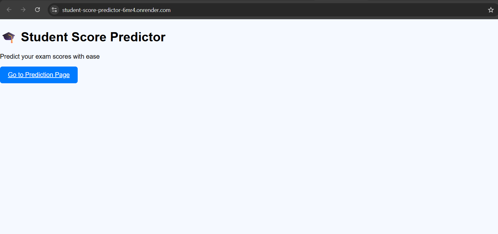
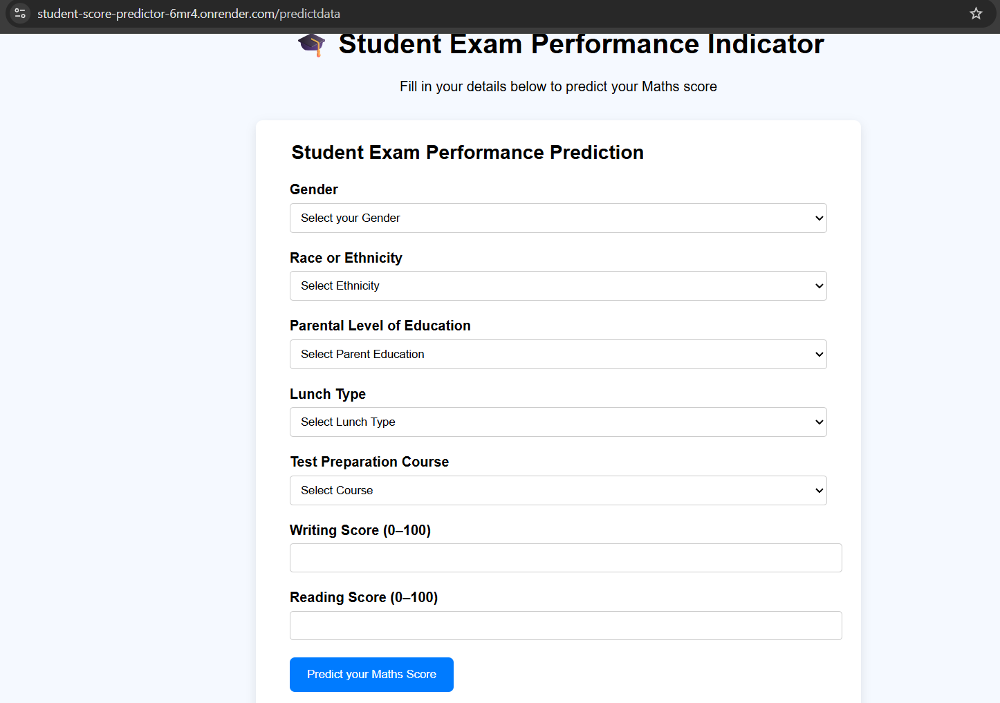

# Student Exam Performance Predictor
A Flask + ML web app that predicts a student's Maths score based on background and past performance.

👉 [Live Demo](https://student-score-predictor-6mr4.onrender.com)

## Screenshots

### Homepage

### Prediction Form

- Responsive form for student details
- Real-time Maths score prediction
- Clean UI with styled results card
- Deployed on Render

**Backend:** Python, Flask  
**Frontend:** HTML, CSS  
**ML Model:** Scikit-learn  
**Deployment:** Render  

- Add more ML models for comparison
- Improve UI with Bootstrap
- Add charts for score distribution

This is my first end-to-end project combining ML + Flask + Deployment.  
Thanks to open-source resources and tutorials that guided me.
